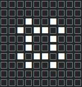
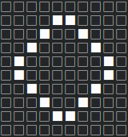
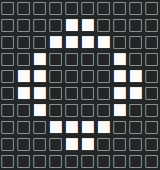
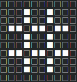

<h1 align="center">C-ellularAutomaton</h1>
<p align="center">
    
</div>
<br>
<p align="center">
Library for simulation of cellular automata, like Conways Game of Life
</p>

<p align="center">
    
    
    
    
    
</div>

<h2 align="center">How to use</h2>

Compile:
```
cmake .
make celautom
./celautom
```

Visit main.c for complete file example.

Include:
```c
#include "CellularAutomata/CellularAutomaton.h"
```

Create ruleset:
```c
//See wikipedia for more detailed information
//https://de.wikipedia.org/wiki/Conways_Spiel_des_Lebens#Alternative_Regel-Bezeichnung
//Digits before slash tell when a live cell survives this iteration:
//E.g.: 23/3 means living cells survive if the have either 2 or 3 neighbors, otherwise they die
//Digits after slash tell when a dead cell becomes alive again:
//E.g.: 23/3 means a dead cell gets revived if it has exactly 3 neighbors
//23/3 is the configuration for conways game of life
char rule[] = "23/3";
```

Create from array:
```c
bool arr[] =
{
    0, 0, 0, 0, 0, 0, 0, 0, 0, 0,
    0, 0, 0, 0, 0, 0, 0, 0, 0, 0,
    0, 0, 0, 1, 0, 0, 1, 0, 0, 0,
    0, 0, 1, 0, 1, 1, 0, 1, 0, 0,
    0, 0, 0, 1, 0, 0, 1, 0, 0, 0,
    0, 0, 0, 1, 0, 0, 1, 0, 0, 0,
    0, 0, 1, 0, 1, 1, 0, 1, 0, 0,
    0, 0, 0, 1, 0, 0, 1, 0, 0, 0,
    0, 0, 0, 0, 0, 0, 0, 0, 0, 0,
    0, 0, 0, 0, 0, 0, 0, 0, 0, 0
};
CellularAutomaton* autom = createAutomatonFromArray(arr, rule, 8, 8);
```

<b>Keep in mind that this area wraps around the edges, meaning that e.g. cells at the right edge neighbor the cells on the left edge.</b>

Initialize randomly:
```c
srand(time(NULL));
//0.4 means the area will be alive by 40%
CellularAutomaton* autom = createAutomaton(rule, 0.4, 20, 20);
```

Run steps:
```c
for (int i = 0; i < 40; i++)
{
    print(autom);
    tick(autom);
    printf("\n");
}
```

<b>Print will print the automaton onto the console. However you can render it however you like by accessing the automatons buffer directly. It's a linear array of bools. Retrieve it by using:;</b>

```c
bool* currentBuffer = getCurrentBuffer(autom);
```

Free memory:
```c
freeAutomaton(autom);
```
